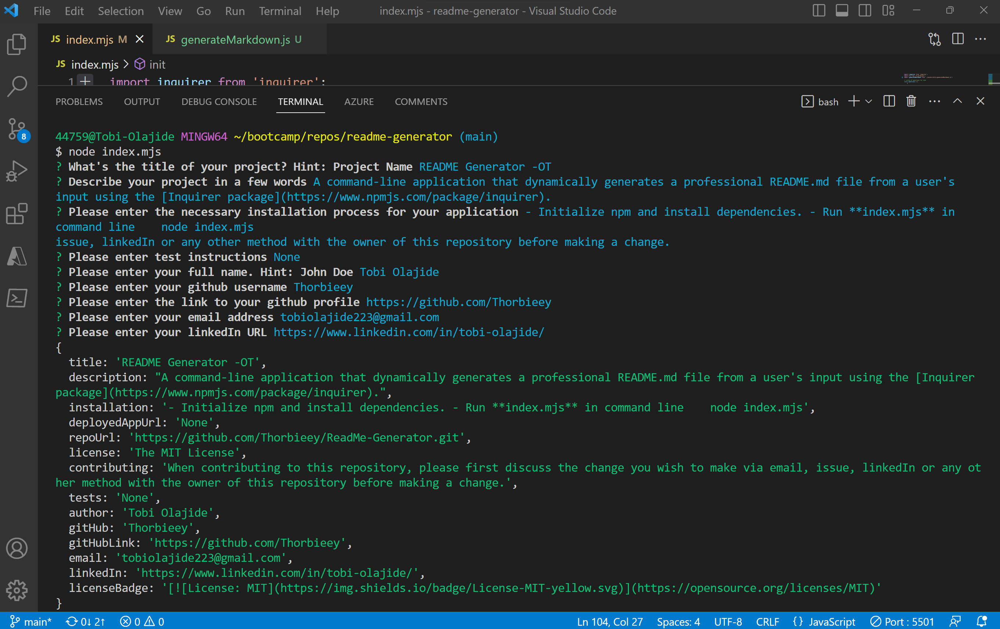
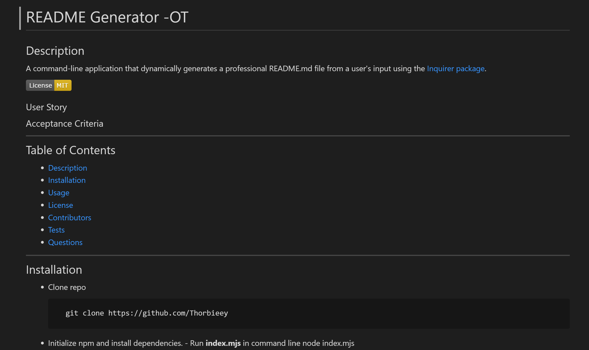
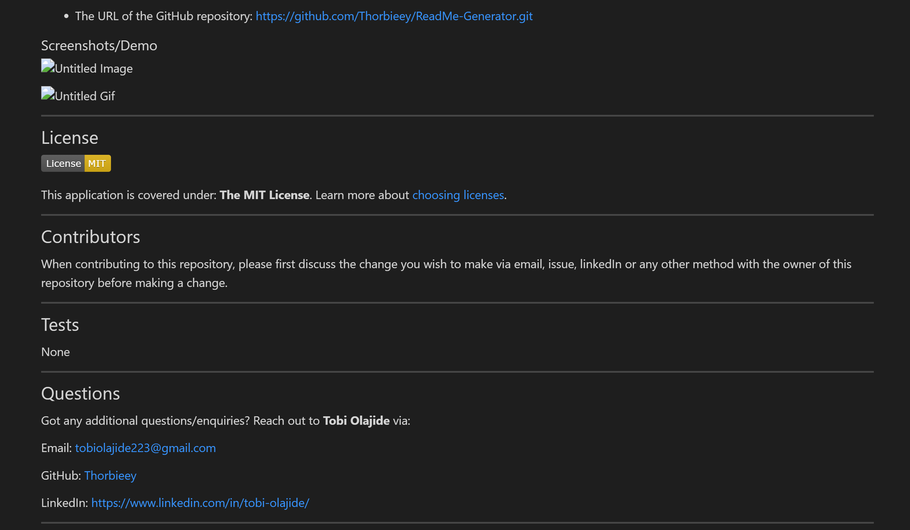

# README Generator -OT
  
## Description 
  
A command-line application that dynamically generates a professional README.md file from a user's inpu using th [Inquirer package](http://www.npmjstes.com/package/inquirer).

### User Story

> As a developer it’s important to have a high-quality README for open source projects created on GitHub
>
>  I want a README generator that can quicky create a professional README for a new project on GitHub
>
>  So that I can devote more time to working on the projects

### Acceptance Criteria

> 1. The README generator app is ran in the command-line and accepts user input.
>
> 2. When a user is prompted for information about the application repository then a high-quality, professional README.md is generated and populated with:
>> * The title of my project 
>> * Description section
>> * Table of Contents 
>> * Installation section
>> * Usage section
>> * License section
>> * Contributing section
>> * Tests section
>> * Questions
>
> 3. When a user enters the project title then it is displayed as the title of the README.
> 
> 4. When a user enters a description, installation instructions, usage information, contribution guidelines, and test instructions then this information is added to the appropriate sections of the README. 
> 
> 5. When a user chosses a license from a list of options then the correspoding badge is added to the README top and information concerning selection is added to the license section of the README.
> 
> 6. When a user enters their email address and GitHub username the information is added to the questions section of README.
>  
> 7. The table of contents links to corresponding sections of the README when clicked.

---
## Table of Contents

* [Description](#description)
* [Installation](#installation)
* [Usage](#usage)
* [License](#license)
* [Contributors](#contributors)
* [Tests](#tests)
* [Questions](#questions)

---
## Installation

- Clone repo

        git clone https://github.com/Thorbieey/ReadMe-Generator.git

- Initialize npm and install dependencies

- Run **index.mjs** in command line

        node index.mjs

---
## Usage 

### Application Links

* The URL to application walkthrough video:
[https://watch.screencastify.com/v/FZ2tJ1qScvx58iz0PDx0](https://watch.screencastify.com/v/FZ2tJ1qScvx58iz0PDx0)

* The URL of the GitHub repository: 
[https://github.com/Thorbieey/ReadMe-Generator.git](https://github.com/Thorbieey/ReadMe-Generator.git)

### Screenshots/Demo

---
## License

This application is covered under: **The MIT License**. Learn more about [choosing licenses](https://choosealicense.com/licenses/).

---
## Contributors

When contributing to this repository, please first discuss the change you wish to make via email, issue, linkedIn or any other method with the owner of this repository before making a change. 

### Pull Request Process

1. Create a feature branch.

        git checkout -b name/feature/new-feature

2. Add and commit your changes.

        git commit -m "short description of feature"

3. Push your contribution to the created branch.

        git push

4. Submit a new Pull Request on GitHub.
---
## Tests

None

---
## Questions

Got any additional questions/enquiries? Reach out to **Tobi Olajide** via:

Email: tobiolajide223@gmail.com

GitHub: [Thorbieey](https://github.com/Thorbieey)

LinkedIn: https://www.linkedin.com/in/tobi-olajide/
  
---
